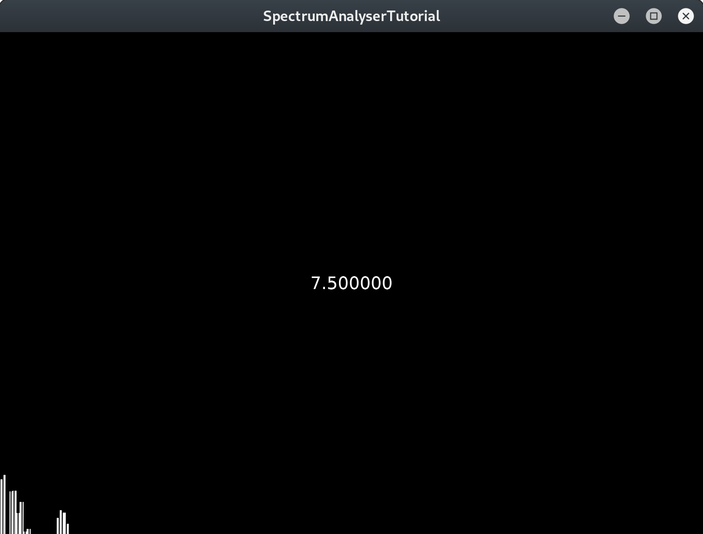

Screenshot is displaying the major 3rd of an A chord.

# Install dependencies
```bash
sudo apt install -y \
g++-8 \
make \
libfreetype6-dev \
libxinerama-dev \
webkit2gtk-4.0 \
ladspa-sdk \
libasound2-dev
```

# Download the source
Clone the repos and patch the source so Projucer will run without a Roli account.
```bash
git clone --depth=1 https://github.com/deanturpin/KEYnote && \
git clone --depth=1 https://github.com/WeAreROLI/JUCE && \
cd JUCE && \
sed -i s/JUCER_ENABLE_GPL_MODE\ 0/JUCER_ENABLE_GPL_MODE\ 1/ extras/Projucer/JuceLibraryCode/AppConfig.h
```

# Build and run KEYnote
```bash
cd ~/KEYnote/ && \
make
```

# JUCE applications
Build and run the JUCE demo application.
```bash
cd ~/JUCE/ && \
make -j $(nproc) --directory examples/DemoRunner/Builds/LinuxMakefile && \
examples/DemoRunner/Builds/LinuxMakefile/build/DemoRunner
```

Build and run Projucer.
```bash
make -j $(nproc) --directory extras/Projucer/Builds/LinuxMakefile && \
extras/Projucer/Builds/LinuxMakefile/build/Projucer
```
